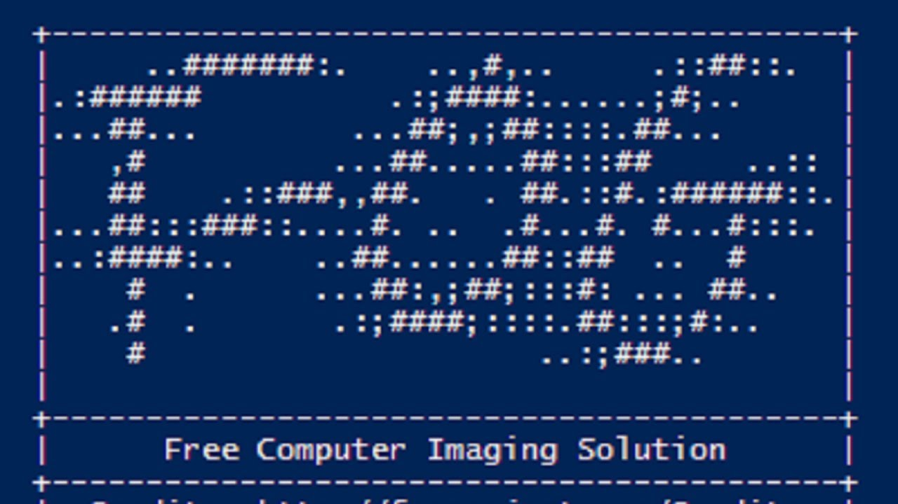

## Welcome to the SunSSC OS Deployment Guide
### Using F.O.G. (Free Open-source Ghost)


## [Video of a image/software deployment in action](https://web.microsoftstream.com/video/e0257dac-b739-4541-8de1-fa4f72231292)
## [How to capture a disk](./capture.md)

### F.O.G. is an open-source OS imaging solution that works over network
**Benefits**
- Can clone or write the whole operating system drive without booting into that drive.
- Can deploy a new prepped Win 10 pro OS in five to ten minutes with just an ethernet cable. It will then auto change hostname and join domain while pdq finishes the rest.

### Pre-Requisites
- A new hostname for the computer
- Correct BIOS settings
- Ethernet connection to 192.168.16.0/21 subnet
- Recommend doing relatively soon after delivery

### Required BIOS Config (May differ between models)
```
- UEFI Boot Path Security:
    - **Always,Except Internal HDD&PXE**
    
- Integrated NIC: 
        - **Enable UEFI Network Stack**
        
- Secure Boot:
    - **disabled**
    
- SATA Operation:
    - **AHCI**
    
- Onboard NIC:
    - enabled w/PXE and **at top of Boot Sequence** (_may need a reboot to see in the boot list after enabling_)
```

### Image Deployment
The new computer should now boot into the PXE fog menu (you have three seconds before it boots :p)

Select _Perform Full Host Registration and Inventory_ in the menu. Example below for a sysprepped Windows 10 Pro 2004 UEFI image deployment that will also join AD at the end.

```
_Perform Full Host Registration and Inventory_

Enter hostname for this computer: SSCD777

Enter the image ID to associate with computer (? for listing): ?
- W10UEFI (3)

Enter the image ID to associate with computer (? for listing): 3

Would you like to associate this host with groups? n

Would you like to associate this host with snapins?: n

Would you like to associate a product key to this host?: n

Would you like this host to join a domain, (using default settings)?: y

Enter the primary user for this computer:

Enter the other tag for this computer:

Would you like to deploy image to this computer now?: y

Enter username/password:
```

### Software Deployment
- FOG will join the computer with your chosen hostname to "sunssc.local\_SUNSSC\PDQ" OU in AD
- PDQ will deploy 7zip, Adobe, Chrome, Report Requirements (Sql Clr & .net 2010), dell firmware updates, and AX 2009.
- Computer should get the rest of the settings from GPOs and windows updates from WSUS.
- Check activation status to be sure.
- Label the computer.
- You are done until the computer is being deployed!


### Remaining steps before customer fulfillment
- When the request comes in for a new station, place the computer in the correct AD domain, department, and OU.
- Enter a meaningful description in AD and in the asset management system 
- Device-based licensed software also need to be installed (e.g. office, anti-virus, remote assist tools, vpn, etc.)


### Final Thoughts
- The benefits of elimating time sinkholes are obvious :]

- A unified configuration makes things predictable for us, and makes the workstations interchangeable for the customers. Our attention is less diluted on unique cases and support requests will take shorter time with uniform machines. 

- _Developers_ will benefit because it will reduce testing and bug fixing complexity. It will allow relatively easy self-service imaging for developers.

_Written June 2nd, 2020 by DK_
_Updated June 4th, 2020_
